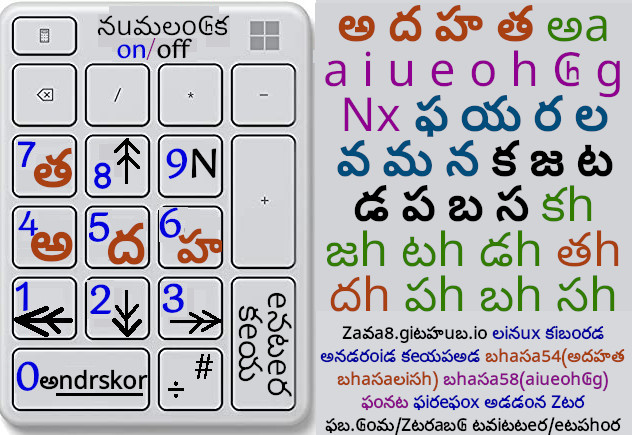

# kibord
## linuks keyboard layout mapping help (vindoz help in nekst section) 

```
/usr/share/X11/xkb $ ls
compat  geometry  keycodes  rules  symbols  types
/usr/share/X11/xkb $ ls -l symbols/zi
-rw-rw-r-- 1 viml viml 32327 Jul  7  2021 symbols/zi
=========
/usr/share/X11/xkb $ cat symbols/zi
(github.com/zava8/kibord zi file)[zilink1]
default  partial alphanumeric_keys modifier_keys
xkb_symbols "basic" {
    name[Group1]= "ing115";
    key  <RALT> {	[  Menu	]	};
// "ԃ"U0502 "à"U00E0 “т”U0442 “н”U043D "ɦ"0266 “ń”U0144 
    key  <KP4> {	[  U00E0,	KP_4	]	};
    key  <KP5> {	[  U0502,	KP_5	]	};
    //key  <KP6> {	[  U0266,	KP_6	]	};
    key  <KP6> {	[  U043D,	KP_6	]	};
    key  <KP7> {	[  U0442,	KP_7	]	};
    key  <KP9> {	[  U0144,	KP_9	]	};

    //key  <KP4> {	[  A,	KP_4	]	};
    //key  <KP5> {	[  D,	KP_5	]	};
    //key  <KP6> {	[  H,	KP_6	]	};
    //key  <KP7> {	[  T,	KP_7	]	};
    //key  <KP9> {	[  N,	KP_9	]	};

/// lenovo ideapad 110 15ISK
    key  <KP1> {	[  KP_Home,         KP_1	]	};
    key  <KP3> {	[  KP_End,          KP_3	]	};
    key  <KP2> {	[  KP_Next,         KP_2	]	};
    key  <KP8> {	[  KP_Prior,        KP_8	]	};

///// dell inspiron
    //key  <KP1> {	[  h,               KP_1	]	};
    //key  <KP3> {	[  colon,           KP_3	]	};
    //key  <KP2> {	[  numbersign,      KP_2	]	}; //question
    //key  <KP8> {	[  at,              KP_8	]	};

    //key  <KP8> {	[  asciicircum,     KP_8	]	};

    key  <KP0> {	[  underscore,	KP_0	]	};
    key <KPDL> {	[  KP_Delete,	KP_Decimal ]	};
    //key <KPDL> {    [  numbersign, KP_Decimal ]   };
};
=========
/usr/share/X11/xkb $ cat symbols/hi
default  partial alphanumeric_keys modifier_keys
xkb_symbols "basic" {
    name[Group1]= "hin115";

    key  <RALT> {       [  Menu ]       };
    key  <KP4> {        [  अ,   KP_4    ]       };
    key  <KP5> {        [  द,   KP_5    ]       };
    key  <KP6> {        [  ह,   KP_6    ]       };
    key  <KP7> {        [  त,   KP_7    ]       };
    key  <KP9> {        [  N,   KP_9    ]       };

    key  <KP1> {	[  KP_Home,	KP_1	]	};
    key  <KP3> {	[  KP_End,	KP_3	]	};
    key  <KP2> {	[  KP_Next,	KP_2	]	};
    key  <KP8> {	[  KP_Prior,	KP_8	]	};
    key  <KP0> {	[  underscore,	KP_0	]	};
    key <KPDL> {  [  numbersign, KP_Decimal ]   };
};
=========

/usr/share/X11/xkb $ vi rules/base.lst  # search for ! layout
# in this section add entry :
! layout
us              English (US)
zi              ing115
hi              hin115
```
some important xkb points:[custom keyboard xkb guide][xkblink1]
to add a keyboard layout to /usr/share/X11/xkb/rules/evdev.xml

1. go to end of &lt;layoutList&gt; section (search for &lt;/layoutList&gt;").
2. Add the folloving after the last "&lt;/layout&gt;" tag

```
    <layout>
       <configItem>
          <name>zi</name>
          <shortDescription>ing115(31):26(a-z)+5(ᴀɦṅꟈᴛ)</shortDescription>
          <description>ing115(31):26(a-z)+5(ᴀɦṅꟈᴛ)</description>
          <languageList>  
             <iso639Id>inc</iso639Id>
          </languageList>
          <countryList>
             <iso3166Id>IN</iso3166Id>
          </countryList>
       </configItem>
       <variantList/>
    </layout>
    <layout>
       <configItem>
          <name>hi</name>
          <shortDescription>hin115 8aiueohcg</shortDescription>
          <description>hin115 8aiueohcg+8ᴀɦṅꟈᴛkvz+11टडपबसयरलमनफ</description>
          <languageList>
             <iso639Id>inc</iso639Id>
          </languageList>
          <countryList>
             <iso3166Id>IN</iso3166Id>
          </countryList>
       </configItem>
       <variantList/>
    </layout>
```
3. invoking niyu evdev, either by **sudo dpkg-reconfigure xkb-data**
3.  or by deleting the xkm files in /var/lib/xkb and either logging out and back in or just switching to a new layout and back
4. setxkbmap us # for us abc ; zi for zy_india abc

</img> <hr/>
</img> <hr/>
</img> <hr/>
</img> <hr/>
</img> <hr/>
</img> <hr/>
</img> <hr/>
</img> <hr/>
</img> <hr/>
</img> <hr/>
</img> <hr/>
</img> <hr/>
</img> <hr/>
</img> <hr/>
</img> <hr/>
</img> <hr/>
</img> <hr/>
</img> <hr/>
[xkblink1]: https://people.uleth.ca/~daniel.odonnell/blog/custom-keyboard-in-linuxx11
[nmpedimez]: nmped.jpg
[zilink1]: https://github.com/zava8/kibord/blob/master/zi
